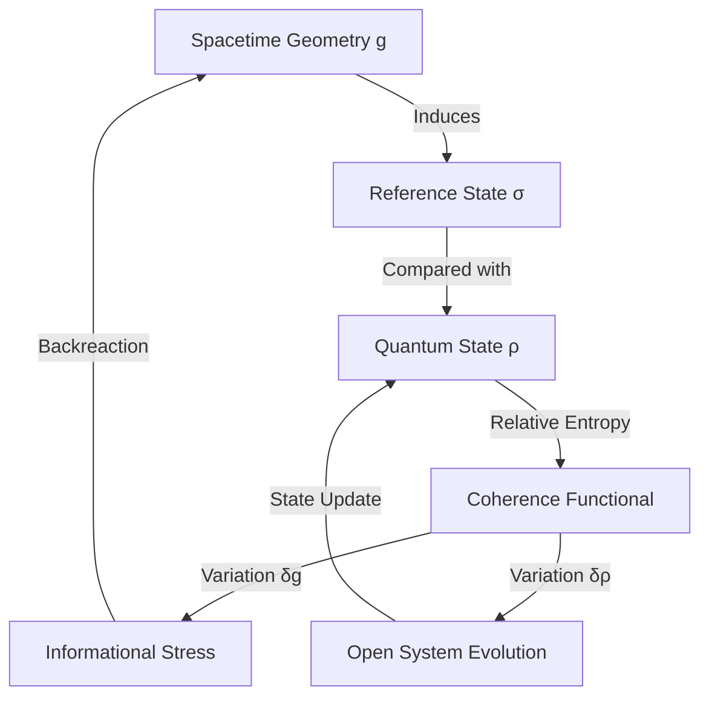
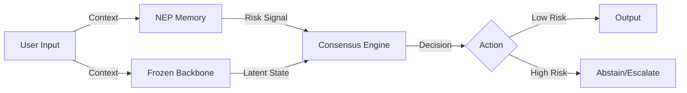
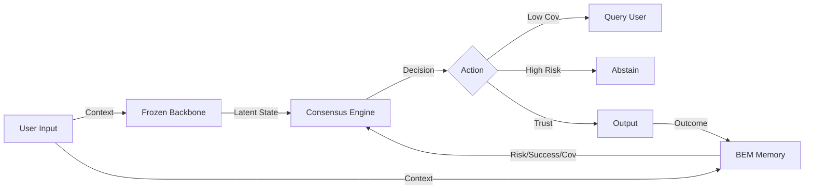

# Coherism & ALFM: The Feedback Loop Project

[](https://creativecommons.org/licenses/by/4.0/)

This repository contains the source code and manuscripts for two parallel research initiatives exploring the role of **feedback loops** in fundamental physics and artificial intelligence.

While operating at opposite ends of the abstraction spectrum—one at the theoretical frontier of quantum gravity, the other at the practical frontier of enterprise AI—both projects share a core intellectual DNA: the emergence of structure through error correction.

## 📂 Repository Structure

### 1. `physics/` - Coherism
**Title:** *Coherism: A Variational Feedback Framework for Quantum Information and Spacetime Geometry*
[](https://doi.org/10.5281/zenodo.17766365)

This directory contains the LaTeX source for the "Coherism" preprint.

*   **The Big Idea:** Gravity is not a fundamental force, but a feedback mechanism where spacetime curves to compensate for entropic "noise" in quantum fields.
*   **Key Concept:** The **Coherence Functional**, a mathematical tool that derives Einstein's equations by minimizing the relative entropy between a quantum state and its geometric reference.
*   **Files:**
    *   `coherism.tex`: Main manuscript
    *   `coherism_refs.bib`: Bibliography
    *   `generate_data.py`: 0D QFT harmonic oscillator simulation
    *   `coherism_frw_simulation.py`: FRW cosmology simulation demonstrating "Coherist friction"

#### 🧬 The Feedback Loop (Coherism)


### 2. `alfm/` - ALFM (AI Systems)
**Title:** *ALFM: Adaptive Latent Feedback Model for Institutional Memory in Foundation Model Deployments*
[](https://doi.org/10.5281/zenodo.17768608)

This directory contains the LaTeX source and validation code for the ALFM framework.

*   **The Big Idea:** A wrapper architecture that enables frozen foundation models (like GPT-4) to "learn" from mistakes instantly without retraining.
*   **Key Concepts:**
    *   **Negative Evidence Prior (NEP):** Vector memory of failure modes for calibrated self-doubt
    *   **Consensus Engine:** Multi-agent arbitration between semantic intuition and heuristic rules
    *   **Three-Tier Adapters:** Safe continual learning with tenant isolation
*   **Files:**
    *   `alfm.tex`: Main manuscript (includes algorithm pseudocode, API examples, failure taxonomy)
    *   `alfm_refs.bib`: Bibliography
    *   `simulate_nep.py`: NEP validation simulation (precision-recall analysis)
    *   `simulate_drift.py`: Adapter stability simulation

#### 🧠 ALFM Architecture


### 3. `alfm_bem/` - ALFM-BEM (Advanced AI Systems)
**Title:** *ALFM-BEM: Bidirectional Experience Memory for Continuous Learning in Foundation Model Deployments*
[](https://doi.org/10.5281/zenodo.17804923)

This directory contains the source for the advanced ALFM-BEM architecture, extending the original ALFM with bidirectional memory and active learning. **Prepared for JMLR submission.**

*   **The Big Idea:** Unifying failure and success memory into a single continuous spectrum, enabling "how did we succeed before?" queries alongside "how did we fail?".
*   **Key Concepts:**
    *   **Bidirectional Experience Memory (BEM):** Single structure for risk, success, and OOD detection
    *   **Query Action:** Active learning capability to request information when OOD
    *   **Bounded Adapters:** Continual learning with provable stability guarantees
*   **Key Results:**
    *   Failure retrieval F1 ≈ 0.59, Success retrieval rate ≈ 0.70 (unique to BEM)
    *   OOD detection AUC > 0.99 for clustered patterns
    *   Healthcare case study: 88% reduction in claim rejections
*   **Files:**
    *   `alfm_bem.tex`: JMLR-format manuscript
    *   `cover_letter.tex`: JMLR submission cover letter
    *   `data_availability.tex`: Code/data availability statement
    *   `src/`: Core implementation (BEM, Consensus Engine, Adapters)
    *   `experiments/`: Full experimental suite (`ablation_study.py`, `threshold_sensitivity.py`, `domain_shift_experiment.py`, `real_backbone_experiment.py`, `healthcare_simulator.py`)

#### 🔄 ALFM-BEM Architecture


---

## 🚀 Compilation

Both papers are written in LaTeX and use `revtex4-2`.

**To compile the Physics paper:**
```bash
cd physics
pdflatex coherism.tex
bibtex coherism
pdflatex coherism.tex
pdflatex coherism.tex
```

**To compile the AI paper (ALFM):**
```bash
cd alfm
pdflatex alfm.tex
bibtex alfm
pdflatex alfm.tex
pdflatex alfm.tex
```

**To compile ALFM-BEM (JMLR submission):**
```bash
cd alfm_bem
pdflatex alfm_bem.tex
bibtex alfm_bem
pdflatex alfm_bem.tex
pdflatex alfm_bem.tex
# Also compile cover letter and data availability
pdflatex cover_letter.tex
pdflatex data_availability.tex
```

## 🔗 The Connection

*   **Coherism (Physics):** Gravity is spacetime correcting for *entropic errors*.
*   **ALFM (AI):** Intelligence is an AI correcting for *prediction errors*.

Both propose a "Universal Theory of Feedback"—one applied to the fabric of the universe, the other to the fabric of artificial intelligence.

## 📄 License

This work is licensed under [CC-BY 4.0](LICENSE). You are free to share and adapt with attribution.

## 📖 Citation

See [CITATION.cff](CITATION.cff) for citation information.

## 🤝 Contributing

Contributions welcome! Please read [CONTRIBUTING.md](CONTRIBUTING.md) first.

---
*Author: David Ahmann*  
*Toronto, Canada*
