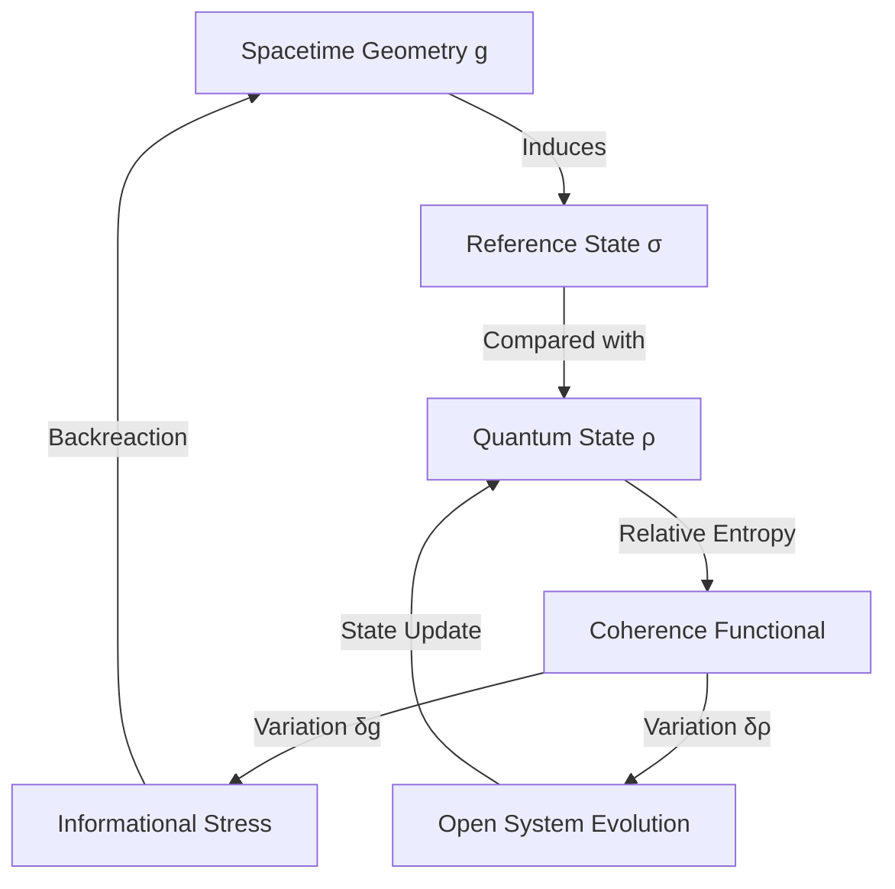
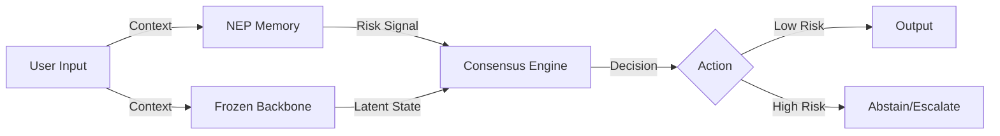
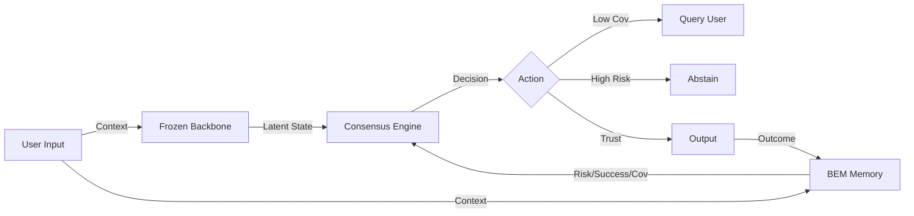

# Coherism & ALFM: The Feedback Loop Project

[](https://creativecommons.org/licenses/by/4.0/)

This repository contains the source code and manuscripts for two parallel research initiatives exploring the role of **feedback loops** in fundamental physics and artificial intelligence.

While operating at opposite ends of the abstraction spectrum—one at the theoretical frontier of quantum gravity, the other at the practical frontier of enterprise AI—both projects share a core intellectual DNA: the emergence of structure through error correction.

## 📂 Repository Structure

### 1. `physics/` - Coherism
**Title:** *Coherence-Dependent Backreaction in Semiclassical and Analog Gravity: Controlled Limits and an Analog-Gravity Test*
[](https://doi.org/10.5281/zenodo.17868263)

This directory contains the LaTeX source for the coherence-functional EFT paper, prepared for *Foundations of Physics*.

*   **The Big Idea:** An informational stress tensor Θ_μν augments semiclassical gravity, coupling quantum-state mismatch (relative entropy to a geometry-adapted reference) to spacetime geometry in a testable way.
*   **Key Concept:** The exact identity `S(ρ‖σ_β) = β_H ΔE − ΔS_vN` fixes the source: relative entropy is the free-energy excess over the Hawking-temperature reference, so coherent and energy-matched thermal injections differ exactly by the injected von Neumann entropy.
*   **Primary Prediction:** BEC near-horizon density modulations ~10⁻⁶ for both injections; the observable is the differential ΔA = κ_eff·ΔS_vN ≈ 2.3×10⁻⁷, which directly measures injected entropy.
*   **Falsification:** Differential below 5×10⁻⁸ would falsify the acoustic implementation.
*   **Key Results:**
    *   Controlled limits: 1+1D conformal (Polyakov), weak-field/Rindler; standard semiclassical behaviour recovered at ρ ≈ σ[g]
    *   Coherent-vs-thermal structure of the analog prediction derived (not assumed) from the free-energy identity
    *   Density-response kernel validated against time-dependent 1D GPE to 0.5%; dominant ordinary-nonlinearity systematic quantified
    *   Detector-model (Unruh-DeWitt) appendix motivating the geometry-dependent GKLS structure
    *   WEP state-dependence owned as a structural constraint channel (η_coh ~ 10⁻³⁰·α, far below current bounds)
*   **Files:**
    *   `coherism.tex`: Main manuscript (revtex4-2, PRD format)
    *   `coherism_refs.bib`: Bibliography
    *   `bec_sonic_horizon_simulation.py`: Analog scaling model + differential observable + robustness scans
    *   `gpe_protocol_simulation.py`: Time-dependent 1D GPE kernel validation + confound study
    *   `coherism_frw_simulation.py`, `generate_data.py`: Archived exploratory scripts (not part of the submission)
    *   `predictions.md`: Falsifiable predictions and experimental protocols

#### 🧬 The Feedback Loop (Coherism)

```mermaid
graph TD
    G[Spacetime Geometry g] -->|Induces| S[Reference State σ]
    S -->|Compared with| R[Quantum State ρ]
    R -->|Relative Entropy| C[Coherence Functional]
    C -->|Variation δg| T[Informational Stress]
    C -->|Variation δρ| L[Open System Evolution]
    T -->|Backreaction| G
    L -->|State Update| R
```

### 2. `alfm/` - ALFM (AI Systems)
**Title:** *ALFM: Adaptive Latent Feedback Model for Institutional Memory in Foundation Model Deployments*
[](https://doi.org/10.5281/zenodo.17768608)

This directory contains the LaTeX source and validation code for the ALFM framework.

*   **The Big Idea:** A wrapper architecture that enables frozen foundation models (like GPT-4) to "learn" from mistakes instantly without retraining.
*   **Key Concepts:**
    *   **Negative Evidence Prior (NEP):** Vector memory of failure modes for calibrated self-doubt
    *   **Consensus Engine:** Multi-agent arbitration between semantic intuition and heuristic rules
    *   **Three-Tier Adapters:** Safe continual learning with tenant isolation
*   **Files:**
    *   `alfm.tex`: Main manuscript (includes algorithm pseudocode, API examples, failure taxonomy)
    *   `alfm_refs.bib`: Bibliography
    *   `simulate_nep.py`: NEP validation simulation (precision-recall analysis)
    *   `simulate_drift.py`: Adapter stability simulation

#### 🧠 ALFM Architecture

```mermaid
graph LR
    User[User Input] -->|Context| BB[Frozen Backbone]
    User -->|Context| NEP[NEP Memory]
    NEP -->|Risk Signal| CE[Consensus Engine]
    BB -->|Latent State| CE
    CE -->|Decision| Action{Action}
    Action -->|Low Risk| Out[Output]
    Action -->|High Risk| Abstain[Abstain/Escalate]
```

### 3. `alfm_bem/` - ALFM-BEM (Advanced AI Systems)
**Title:** *ALFM-BEM: Bidirectional Experience Memory for Continuous Learning in Foundation Model Deployments*
[](https://doi.org/10.5281/zenodo.17868262)

This directory contains the source for the advanced ALFM-BEM architecture, extending the original ALFM with bidirectional memory and active learning. **Prepared for JMLR submission.**

*   **The Big Idea:** Unifying failure and success memory into a single continuous spectrum, enabling "how did we succeed before?" queries alongside "how did we fail?".
*   **Key Concepts:**
    *   **Bidirectional Experience Memory (BEM):** Single structure for risk, success, and OOD detection
    *   **Query Action:** Active learning capability to request information when OOD
    *   **Bounded Adapters:** Continual learning with provable stability guarantees
*   **Key Results:**
    *   Failure retrieval F1 ≈ 0.59, success retrieval rate ≈ 0.70 (bidirectional capability RAG lacks)
    *   OOD detection AUC ≈ 1.0 for clustered patterns (canonical setup)
    *   Healthcare case study (simulation): ≈11.6% → ≈2.5% rejection-on-submitted overall (≈1.2% final window) (seed=42, N=2000), with ≈11–16% abstain rate
    *   Query action improves accuracy by ≈6.2% in a high-uncertainty toy simulation
*   **Key Differentiator vs RAG:** BEM stores experiences with outcomes, not documents—enabling learning from deployment without human curation
*   **Files:**
    *   `alfm_bem.tex`: JMLR-format manuscript
    *   `cover_letter.tex`: JMLR submission cover letter
    *   `data_availability.tex`: Code/data availability statement
    *   `src/`: Core implementation (BEM, Consensus Engine, Adapters)
    *   `experiments/`: Full experimental suite (`ablation_study.py`, `threshold_sensitivity.py`, `domain_shift_experiment.py`, `real_backbone_experiment.py`, `healthcare_simulator.py`)

#### 🔄 ALFM-BEM Architecture

```mermaid
graph LR
    User[User Input] -->|Context| BB[Frozen Backbone]
    User -->|Context| BEM[BEM Memory]
    BEM -->|Risk/Success/Cov| CE[Consensus Engine]
    BB -->|Latent State| CE
    CE -->|Decision| Action{Action}
    Action -->|Low Cov| Query[Query User]
    Action -->|High Risk| Abstain[Abstain]
    Action -->|Trust| Out[Output]
    Out -->|Outcome| BEM
```

---

## 🚀 Compilation

Both papers are written in LaTeX and use `revtex4-2`.

**To compile the Physics paper:**
```bash
cd physics
pdflatex coherism.tex
bibtex coherism
pdflatex coherism.tex
pdflatex coherism.tex
```

**To compile the AI paper (ALFM):**
```bash
cd alfm
pdflatex alfm.tex
bibtex alfm
pdflatex alfm.tex
pdflatex alfm.tex
```

**To compile ALFM-BEM (JMLR submission):**
```bash
cd alfm_bem
pdflatex alfm_bem.tex
bibtex alfm_bem
pdflatex alfm_bem.tex
pdflatex alfm_bem.tex
# Also compile cover letter and data availability
pdflatex cover_letter.tex
pdflatex data_availability.tex
```

## 🔗 The Connection

*   **Coherism (Physics):** Gravity is spacetime correcting for *entropic errors*.
*   **ALFM (AI):** Intelligence is an AI correcting for *prediction errors*.

Both propose a "Universal Theory of Feedback"—one applied to the fabric of the universe, the other to the fabric of artificial intelligence.

## 📄 License

This work is licensed under [CC-BY 4.0](LICENSE). You are free to share and adapt with attribution.

## 📖 Citation

See [CITATION.cff](CITATION.cff) for citation information.

## 🤝 Contributing

Contributions welcome! Please read [CONTRIBUTING.md](CONTRIBUTING.md) first.

---
*Author: David Ahmann*  
*Toronto, Canada*
