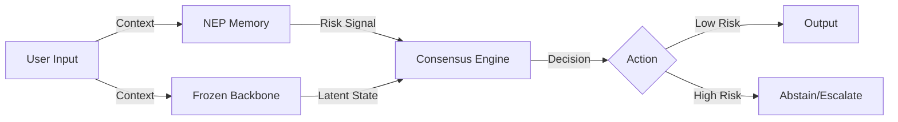
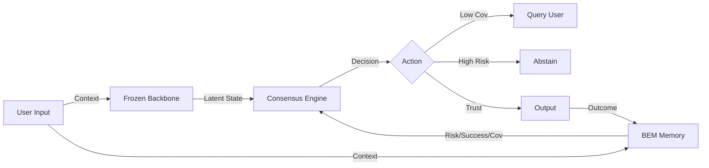

# Coherism and ALFM Research Repository

[](https://creativecommons.org/licenses/by/4.0/)

This repository contains independent physics and artificial-intelligence research projects. Each project states its own claim boundary; the shared repository name is not evidence of a common physical theory.

## 📂 Repository Structure

### 1. `physics/` - Coherism
**Title:** *A Worked Identifiability Audit of a Stipulated Preparation-Indexed Potential in a Homogeneous Bose--Einstein Condensate*

This directory contains a cautionary methods note and its reproducibility material. A formal GPD review found that the work is not a *Foundations of Physics* contribution without genuinely new science; the current paper is intentionally narrower.

*   **Exact result:** For a specified finite phonon band and full-support Gibbs reference, `D(ρ‖σ_β) = β ΔE − ΔS`. Ideal equal-energy displaced-thermal and heated product-thermal preparations therefore differ in relative entropy by the added entropy of the heated preparation.
*   **Stipulated step:** A preparation-indexed external potential proportional to that finite-mode relative entropy is assigned with a free coupling `κ`. The map, profile, sign, coupling, and intervention are not derived from condensate physics.
*   **Identifiability result:** A fixed-particle-number stationary GP/BdG kernel propagates the imposed potential. The same localized response is reproduced by independent stationary GP relaxation. A separate seeded classical-field calculation is generic control motivation, not a matched nuisance model, thermal state, or calibrated noise floor.
*   **Prospective output:** Given a future, independently calibrated residual budget, the model defines a conditional bound on `|κ|`. It does not provide a detection forecast or falsification threshold.
*   **Key Results:**
    *   Finite-mode Gibbs-reference identity and ideal preparation contrast
    *   Coupling-normalized fixed-number response template
    *   Like-for-like localized-profile agreement between the analytic kernel and imaginary-time GP relaxation
    *   Explicit intervention, preparation, zero-mode, nuisance, covariance, and estimator limitations
    *   No analogue-gravity or gravitational inference
*   **Files:**
    *   `coherism.tex`: Symlink to the canonical `paper/main.tex` manuscript source
    *   `coherism_refs.bib`: Bibliography
    *   `bec_sonic_horizon_simulation.py`: Legacy-named finite-mode identity, coupling-normalized response, and prospective-bound calculation
    *   `gpe_protocol_simulation.py`: Nonzero-mode and localized fixed-number response checks plus a seeded classical-field illustration
    *   `coherism_frw_simulation.py`, `generate_data.py`: Archived exploratory scripts that do not support the current manuscript
    *   `predictions.md`: Current claim status and prospective validation contract

#### Model boundary
```mermaid
graph TD
    R[Finite-band preparation ρ] --> D[Exact relative entropy D(ρ‖σβ)]
    D -->|stipulated free coupling κ| S[State-indexed external potential]
    S --> K[Fixed-number stationary GP/BdG template]
    K --> I{Identifiable after calibrated nuisances?}
    I -->|No current evidence| B[Prospective bound only]
```

### 2. `alfm/` - ALFM (AI Systems)
**Title:** *ALFM: Adaptive Latent Feedback Model for Institutional Memory in Foundation Model Deployments*
[](https://doi.org/10.5281/zenodo.17768608)

This directory contains the LaTeX source and validation code for the ALFM framework.

*   **The Big Idea:** A wrapper architecture that enables frozen foundation models (like GPT-4) to "learn" from mistakes instantly without retraining.
*   **Key Concepts:**
    *   **Negative Evidence Prior (NEP):** Vector memory of failure modes for calibrated self-doubt
    *   **Consensus Engine:** Multi-agent arbitration between semantic intuition and heuristic rules
    *   **Three-Tier Adapters:** Safe continual learning with tenant isolation
*   **Files:**
    *   `alfm.tex`: Main manuscript (includes algorithm pseudocode, API examples, failure taxonomy)
    *   `alfm_refs.bib`: Bibliography
    *   `simulate_nep.py`: NEP validation simulation (precision-recall analysis)
    *   `simulate_drift.py`: Adapter stability simulation

#### 🧠 ALFM Architecture

```mermaid
graph LR
    User[User Input] -->|Context| BB[Frozen Backbone]
    User -->|Context| NEP[NEP Memory]
    NEP -->|Risk Signal| CE[Consensus Engine]
    BB -->|Latent State| CE
    CE -->|Decision| Action{Action}
    Action -->|Low Risk| Out[Output]
    Action -->|High Risk| Abstain[Abstain/Escalate]
```

### 3. `alfm_bem/` - ALFM-BEM (Advanced AI Systems)
**Title:** *ALFM-BEM: Bidirectional Experience Memory for Continuous Learning in Foundation Model Deployments*
[](https://doi.org/10.5281/zenodo.17868262)

This directory contains the source for the advanced ALFM-BEM architecture, extending the original ALFM with bidirectional memory and active learning. **Prepared for JMLR submission.**

*   **The Big Idea:** Unifying failure and success memory into a single continuous spectrum, enabling "how did we succeed before?" queries alongside "how did we fail?".
*   **Key Concepts:**
    *   **Bidirectional Experience Memory (BEM):** Single structure for risk, success, and OOD detection
    *   **Query Action:** Active learning capability to request information when OOD
    *   **Bounded Adapters:** Continual learning with provable stability guarantees
*   **Key Results:**
    *   Failure retrieval F1 ≈ 0.59, success retrieval rate ≈ 0.70 (bidirectional capability RAG lacks)
    *   OOD detection AUC ≈ 1.0 for clustered patterns (canonical setup)
    *   Healthcare case study (simulation): ≈11.6% → ≈2.5% rejection-on-submitted overall (≈1.2% final window) (seed=42, N=2000), with ≈11–16% abstain rate
    *   Query action improves accuracy by ≈6.2% in a high-uncertainty toy simulation
*   **Key Differentiator vs RAG:** BEM stores experiences with outcomes, not documents—enabling learning from deployment without human curation
*   **Files:**
    *   `alfm_bem.tex`: JMLR-format manuscript
    *   `cover_letter.tex`: JMLR submission cover letter
    *   `data_availability.tex`: Code/data availability statement
    *   `src/`: Core implementation (BEM, Consensus Engine, Adapters)
    *   `experiments/`: Full experimental suite (`ablation_study.py`, `threshold_sensitivity.py`, `domain_shift_experiment.py`, `real_backbone_experiment.py`, `healthcare_simulator.py`)

#### 🔄 ALFM-BEM Architecture

```mermaid
graph LR
    User[User Input] -->|Context| BB[Frozen Backbone]
    User -->|Context| BEM[BEM Memory]
    BEM -->|Risk/Success/Cov| CE[Consensus Engine]
    BB -->|Latent State| CE
    CE -->|Decision| Action{Action}
    Action -->|Low Cov| Query[Query User]
    Action -->|High Risk| Abstain[Abstain]
    Action -->|Trust| Out[Output]
    Out -->|Outcome| BEM
```

---

## 🚀 Compilation

The manuscripts are written in LaTeX; the physics and ALFM manuscripts use `revtex4-2`.

**To compile the Physics paper:**
```bash
cd physics
pdflatex coherism.tex
bibtex coherism
pdflatex coherism.tex
pdflatex coherism.tex
```

**To compile the AI paper (ALFM):**
```bash
cd alfm
pdflatex alfm.tex
bibtex alfm
pdflatex alfm.tex
pdflatex alfm.tex
```

**To compile ALFM-BEM (JMLR submission):**
```bash
cd alfm_bem
pdflatex alfm_bem.tex
bibtex alfm_bem
pdflatex alfm_bem.tex
pdflatex alfm_bem.tex
# Also compile cover letter and data availability
pdflatex cover_letter.tex
pdflatex data_availability.tex
```

## 🔗 Repository relationship

The physics and AI projects are maintained together for convenience. They do not jointly establish a universal feedback theory, and results from one project are not evidence for the other.

## 📄 License

This work is licensed under [CC-BY 4.0](LICENSE). You are free to share and adapt with attribution.

## 📖 Citation

See [CITATION.cff](CITATION.cff) for citation information.

## 🤝 Contributing

Contributions welcome! Please read [CONTRIBUTING.md](CONTRIBUTING.md) first.

---
*Author: David Ahmann*  
*Toronto, Canada*
