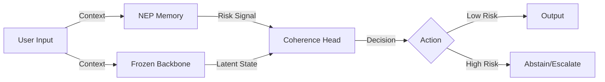

# Coherism & ALFM: The Feedback Loop Project

This repository contains the source code and manuscripts for two parallel research initiatives exploring the role of **feedback loops** in fundamental physics and artificial intelligence.

While operating at opposite ends of the abstraction spectrum—one at the theoretical frontier of quantum gravity, the other at the practical frontier of enterprise AI—both projects share a core intellectual DNA: the emergence of structure through error correction.

## 📂 Repository Structure

### 1. `physics/` - Coherism
**Title:** *Coherism: A Variational Feedback Framework for Quantum Information and Spacetime Geometry*

This directory contains the LaTeX source and figures for the "Coherism" preprint.

*   **The Big Idea:** Gravity is not a fundamental force, but a feedback mechanism where spacetime curves to compensate for entropic "noise" in quantum fields.
*   **Key Concept:** The **Coherence Functional**, a mathematical tool that derives Einstein's equations by minimizing the relative entropy between a quantum state and its geometric reference.
*   **Files:**
    *   `coherism.tex`: Main manuscript.
    *   `references.bib`: Bibliography.
    *   `figures/`: TikZ and PDF figures illustrating the feedback loop.
    *   `generate_data.py`: A Python script simulating a 0D QFT harmonic oscillator to demonstrate "Coherist friction" (energy loss due to informational feedback).

#### 🧬 The Feedback Loop (Coherism)


### 2. `alfm/` - ALFM (AI Systems)
**Title:** *ALFM: Adaptive Latent Feedback Model for Institutional Memory in Foundation Model Deployments*

This directory contains the LaTeX source and validation logic for the ALFM framework.

*   **The Big Idea:** A wrapper architecture that enables frozen foundation models (like GPT-4) to "learn" from mistakes instantly without retraining.
*   **Key Concept:** The **Negative Evidence Prior (NEP)**, a vector memory of failure modes that allows the model to exhibit "calibrated self-doubt" and avoid repeating errors.
*   **Files:**
    *   `alfm.tex`: Main manuscript.
    *   `references.bib`: Bibliography.
    *   `figures/`: Architecture diagrams.
    *   `simulate_nep.py`: A Python simulation of the Negative Evidence Prior, demonstrating how contrastive projection retrieves failure modes using cosine similarity.

#### 🧠 ALFM Architecture


---

## 🚀 Compilation

Both papers are written in LaTeX and use `revtex4-2`.

**To compile the Physics paper:**
```bash
cd physics
pdflatex coherism.tex
bibtex coherism
pdflatex coherism.tex
pdflatex coherism.tex
```

**To compile the AI paper:**
```bash
cd alfm
pdflatex alfm.tex
bibtex alfm
pdflatex alfm.tex
pdflatex alfm.tex
```

## 🔗 The Connection

*   **Coherism (Physics):** Gravity is spacetime correcting for *entropic errors*.
*   **ALFM (AI):** Intelligence is an AI correcting for *prediction errors*.

Both propose a "Universal Theory of Feedback"—one applied to the fabric of the universe, the other to the fabric of artificial intelligence.

---
*Author: David Ahmann*
